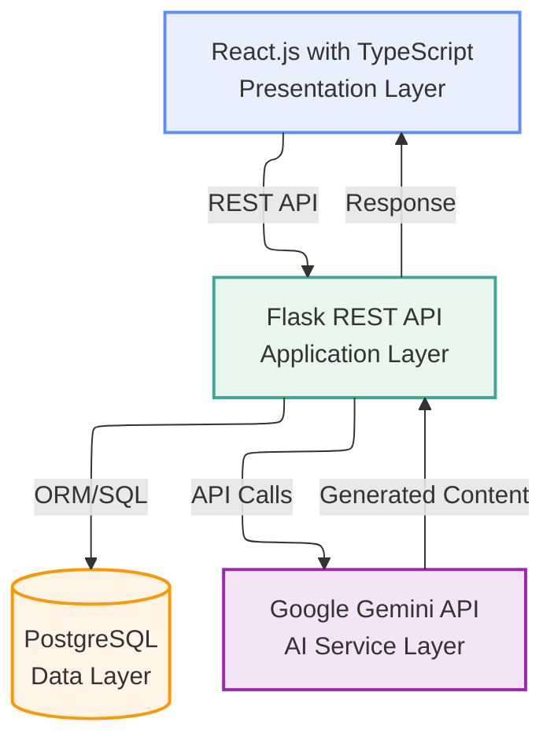
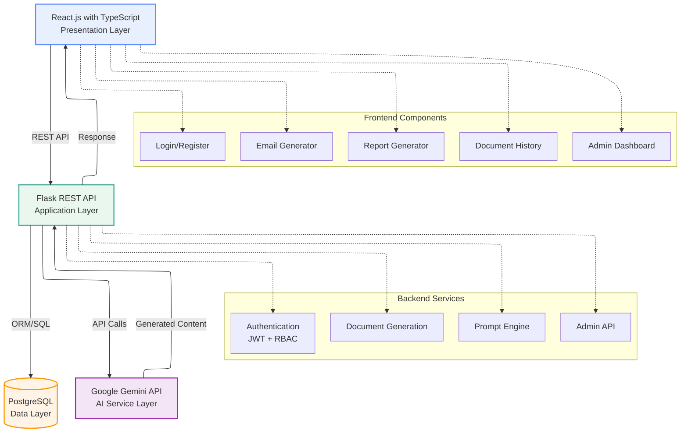

# GenAI Email & Report Drafting System

[](LICENSE)
[](https://github.com/SrivariHSSPL-2026/genai-email-report-drafting)
[](docs/05_architecture_plan.md)
[](https://www.python.org/)
[](https://www.typescriptlang.org/)
[](https://react.dev/)
[](https://flask.palletsprojects.com/)
[](https://www.postgresql.org/)
[](https://ai.google.dev/)
[](https://github.com/SrivariHSSPL-2026)

An AI-driven application that generates professional emails and reports using `Google Gemini`, built with an `N-Tier enterprise architecture` comprising `React.js with TypeScript`, `Flask`, and `PostgreSQL`, with `JWT-based authentication and role-based access control`.

---

## CI Status

[](https://github.com/Srivari-Hema-SSPL-2026/genai-email-report-drafting/actions/workflows/ci-python.yml)
[](https://github.com/Srivari-Hema-SSPL-2026/genai-email-report-drafting/actions/workflows/ci-frontend.yml)

---

## 📑 Table of Contents

- [Abstract](#-abstract)
- [Problem Statement](#-problem-statement)
- [Who This Is For / Who This Is Not For](#-who-this-is-for--who-this-is-not-for)
- [What This Project Covers](#-what-this-project-covers)
- [Key Features](#-key-features)
- [System Architecture](#-system-architecture)
- [Technology Stack](#-technology-stack)
- [Quick Start](#-quick-start)
- [Repository Structure](#-repository-structure)
- [Documentation](#-documentation)
- [Key Principles](#-key-principles)
- [Success Criteria](#-success-criteria)
- [Development & Quality Assurance](#️-development--quality-assurance)
- [Contributing](#-contributing)
- [About & Community](#-about--community)
- [License](#-license)

---

## 📌 Abstract

Professional communication through emails and reports is a time-consuming and repetitive activity in corporate and academic environments. This project presents an `AI-Driven Email and Report Drafting System` that leverages `Generative Artificial Intelligence (GenAI)` using `Google Gemini Large Language Models` to automatically generate high-quality, context-aware written content.

The system is implemented using an `N-Tier architecture` comprising a `React.js with TypeScript frontend`, a `Flask-based RESTful backend`, and a `PostgreSQL database`. Secure access control is enforced using `JWT-based authentication` with `Role-Based Access Control (RBAC)`. The solution demonstrates how Generative AI can be integrated into enterprise-grade software systems while maintaining controlled complexity suitable for academic evaluation.

The system employs `instruction-based prompt engineering` optimized for Google Gemini's instruction-following capabilities. Users can generate professional emails and reports by providing purpose, tone, and contextual inputs. All generated content is persisted in the database for future reference and auditing purposes.

The project successfully demonstrates the practical application of Generative AI within a secure, enterprise-style architecture. By balancing simplicity and architectural rigor, the system provides a strong academic foundation while remaining extensible for real-world deployment scenarios.

---

## 🎯 Problem Statement

Effective written communication plays a critical role in professional workflows. However, several challenges exist in the current approach to drafting professional emails and reports:

- Time Consumption: Manual drafting of emails and reports consumes significant time that could be better utilized for other tasks
- Consistency Challenges: Maintaining consistent tone and structure across multiple documents is challenging, especially when working under time constraints
- Security Gaps: Many AI-powered tools lack proper secure access control and data persistence, making them unsuitable for enterprise environments
- Architectural Limitations: Most small-scale AI tools ignore enterprise architectural principles, making them difficult to scale and maintain
- Quality Variability: Output quality often depends heavily on the writer's skill level and available time, leading to inconsistent results

This project addresses these challenges by providing a secure, enterprise-grade solution that automates content generation while maintaining professional standards and architectural best practices.

---

## 👥 Who This Is For / Who This Is Not For

### ✅ Who This Is For

- Students and Academics: Learning N-Tier architecture, GenAI integration, and enterprise software development
- Developers: Building AI-powered applications with proper authentication and data persistence
- Engineers: Understanding how to integrate Google Gemini API into production systems
- Architects: Studying enterprise-grade architecture patterns and security best practices
- Educators: Teaching modern web development with AI integration

### ❌ Who This Is Not For

- Those seeking a production-ready SaaS solution without customization
- People looking for a simple AI chatbot (this is a specialized document generation system)
- Those who want to avoid setting up databases and backend infrastructure
- Anyone expecting a no-code solution (this requires technical setup)

---

## 📚 What This Project Covers

**This IS:**

- A complete N-Tier enterprise application with frontend, backend, and database
- Production-grade implementation with authentication, authorization, and audit logging
- Practical GenAI integration using Google Gemini API
- Comprehensive prompt engineering strategies
- Full-stack development example (React + Flask + PostgreSQL)
- Educational reference for academic projects

**This is NOT:**

- A commercial SaaS product (it's an educational/academic project)
- A simple AI tool (it's a full enterprise application)
- A tutorial or step-by-step guide (it's a complete implementation)
- A production deployment guide (focuses on development and learning)

### Core Capabilities

- AI-Powered Content Generation: Professional emails and reports using Google Gemini
- Enterprise Architecture: N-Tier design with clear separation of concerns
- Security: JWT authentication, RBAC, secure password hashing, audit trails
- Data Persistence: PostgreSQL with proper relationships and indexing
- Modern Frontend: React.js with TypeScript, Redux Toolkit, Tailwind CSS
- RESTful API: Flask backend with comprehensive error handling
- Testing: 127+ unit and integration tests

---

## 🎯 Key Features

- ✨ **AI-Powered Content Generation**
  - Email generation with customizable tone (professional, formal, casual, friendly)
  - Report generation with multiple structures (executive summary, detailed, bullet points)
  - Context-aware content using Google Gemini Large Language Models
  - Real-time generation with proper error handling and retry logic

- 🧱 **Enterprise-Grade N-Tier Architecture**
  - Presentation Layer: React.js with TypeScript, Redux Toolkit, and Tailwind CSS
  - Application Layer: Flask REST API with JWT authentication and RBAC
  - Data Layer: PostgreSQL with SQLAlchemy ORM and proper relationships
  - AI Service Layer: Google Gemini API integration with prompt engineering
  - Clear separation of concerns enabling scalability and maintainability

- 🔐 **Secure Authentication & Authorization**
  - JWT-based stateless authentication with token refresh support
  - Secure password hashing using Werkzeug security utilities
  - Protected API endpoints with role-based access control
  - Login/Register pages with proper validation and error handling

- 👥 **Role-Based Access Control (RBAC)**
  - `User Role`: Generate documents, view personal history
  - `Admin Role`: Full system access including audit logs and system metrics
  - Admin dashboard with system summary, audit log viewer, and user management
  - Route protection at both frontend (PrivateRoute, AdminRoute) and backend levels

- 🗄️ **Comprehensive Data Persistence**
  - User accounts with secure credential storage
  - Document history with metadata (tone, structure, timestamps)
  - Complete audit trail for all system actions (login, document generation, admin operations)
  - Foreign key relationships with cascade delete for data integrity

- 🧠 **Advanced Prompt Engineering**
  - Structured prompt construction optimized for Google Gemini
  - Tone selection: Professional, Formal, Casual, Friendly
  - Report structures: Executive Summary, Detailed, Bullet Points
  - Instruction-based prompts with role definition and format constraints
  - Input validation and sanitization before API calls

- 📜 **Document History & Management**
  - User-specific document history with filtering (all, email, report)
  - Document detail view with full content and metadata
  - Chronological sorting and pagination support
  - Cross-user access prevention for security

- 📊 **Admin Dashboard & Audit System**
  - System summary with user counts, document statistics, and recent activity
  - Comprehensive audit log viewer with pagination
  - Real-time metrics and activity monitoring
  - Request correlation IDs for traceability across system layers

- 🧪 **Comprehensive Testing Suite**
  - 127+ unit and integration tests covering all major components
  - Backend tests with mocked Gemini API (no external dependencies)
  - Frontend TypeScript compilation and ESLint validation
  - Test coverage for authentication, RBAC, document generation, and admin features

- 🚀 **Production-Ready Features**
  - Error handling with user-friendly messages
  - Request correlation tracking for debugging
  - API rate limiting and timeout management
  - Environment-based configuration (development, production, test)
  - CI/CD workflows for automated testing and validation

---

## 🏗️ System Architecture

### High-Level Architecture Diagram



### Detailed Architecture Diagram



**ASCII Fallback:**

```text
┌─────────────────────────────────────────────────────────────────┐
│                    Presentation Layer                           │
│              React.js with TypeScript Frontend                  │
│  ┌──────────┐  ┌──────────┐  ┌──────────┐  ┌──────────┐         │
│  │  Login   │  │  Email   │  │  Report  │  │  History │         │
│  │ Register │  │ Generator│  │ Generator│  │  Admin   │         │
│  └──────────┘  └──────────┘  └──────────┘  └──────────┘         │
└───────────────────────┬─────────────────────────────────────────┘
                        │ REST API (HTTP/JSON)
                        │ JWT Authentication
                        ↓
┌─────────────────────────────────────────────────────────────────┐
│                    Application Layer                            │
│                      Flask REST API                             │
│  ┌──────────────┐  ┌──────────────┐  ┌──────────────┐           │
│  │ Auth Service │  │  Document    │  │   Prompt     │           │
│  │ JWT + RBAC   │  │  Generation  │  │   Engine     │           │
│  └──────────────┘  └──────────────┘  └──────────────┘           │
└───────────┬──────────────────────────────┬──────────────────────┘
            │                              │
            │ ORM/SQL                      │ API Calls
            ↓                              ↓
┌───────────────────────┐    ┌──────────────────────────────────┐
│     Data Layer        │    │      AI Service Layer            │
│   PostgreSQL          │    │   Google Gemini API              │
│                       │    │                                  │
│  • Users              │    │  • Content Generation            │
│  • Documents          │    │  • Prompt Processing             │
│  • Audit Logs         │    │  • Response Handling             │
└───────────────────────┘    └──────────────────────────────────┘
```

### Architecture Layers

- **Presentation Layer**: React.js with TypeScript SPA for user interaction
- **Application Layer**: Flask REST API handling business logic and security
- **Data Layer**: PostgreSQL for persistent storage
- **AI Service Layer**: Google Gemini for text generation

---

## 🧰 Technology Stack

| Layer | Technology |
|-----|-----------|
| Frontend | React.js with TypeScript |
| Backend | Python (Flask) |
| Database | PostgreSQL |
| Authentication | JWT |
| AI Model | Google Gemini |
| Version Control | GitHub |

---

## 📞 About & Community

### [Swamy's Tech Skills Academy](https://www.linkedin.com/company/swamy-s-tech-skills-academy) & [ShyvnTech](https://www.linkedin.com/company/shyvntech)

This repository is stewarded and supported by **Swamy's Tech Skills Academy** and **ShyvnTech**. It demonstrates enterprise-grade software development practices and serves as an educational reference for modern full-stack development with AI integration.

You can connect with the community to:

- Learn enterprise architecture patterns
- Study GenAI integration best practices
- Explore modern web development techniques
- Participate in knowledge-sharing discussions
- Access mentoring and training opportunities

---

## 📝 Attribution

All content in this repository is original and transformative. While inspired by various learning sources and best practices, the implementation, architecture, prompts, and documentation are created from first principles to provide a unique educational experience.

---

## 📜 License

This project is licensed under the [MIT License](LICENSE). See the [LICENSE](LICENSE) file for details.

This project is intended for **academic and educational use**.

---

## 🙌 Acknowledgements

- **Google Gemini API** - For providing the AI capabilities
- **Flask & React Communities** - For excellent open-source frameworks
- **PostgreSQL** - For robust database capabilities
- **Open Source Contributors** - For the tools and libraries that made this possible

---

> 🎓 **GenAI Email & Report Drafting System** — Designed and maintained by `Vattem Hema`  
> Demonstrating enterprise-grade architecture with Generative AI integration.  
> © 2026 Swamy's Tech Skills Academy, ShyvnTech & Srivari Software Solutions

**⭐ If you find this project useful, feel free to star the repository.**
