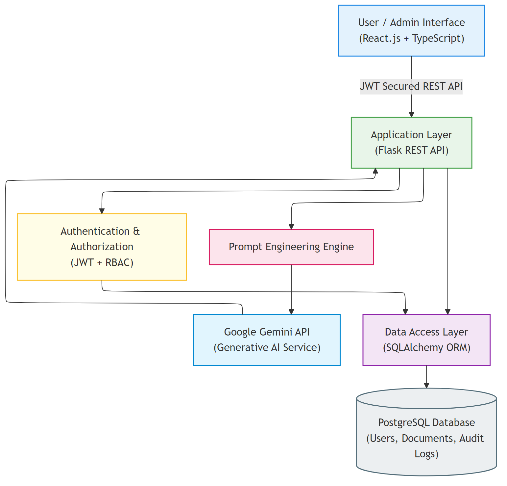
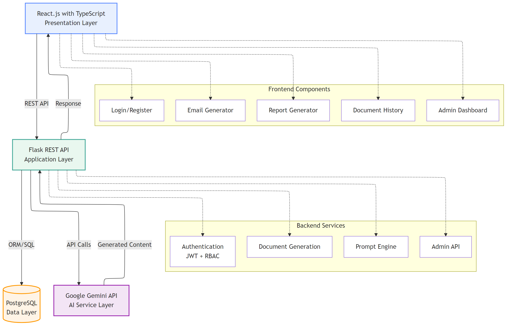
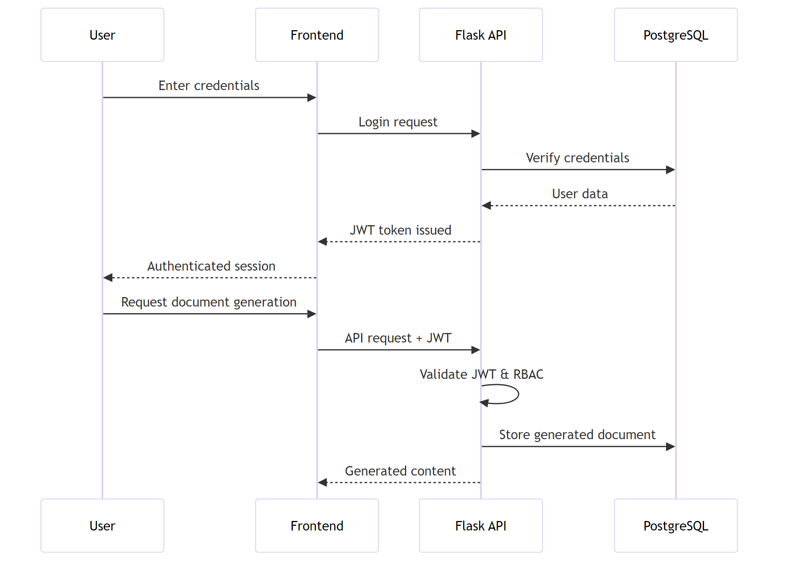
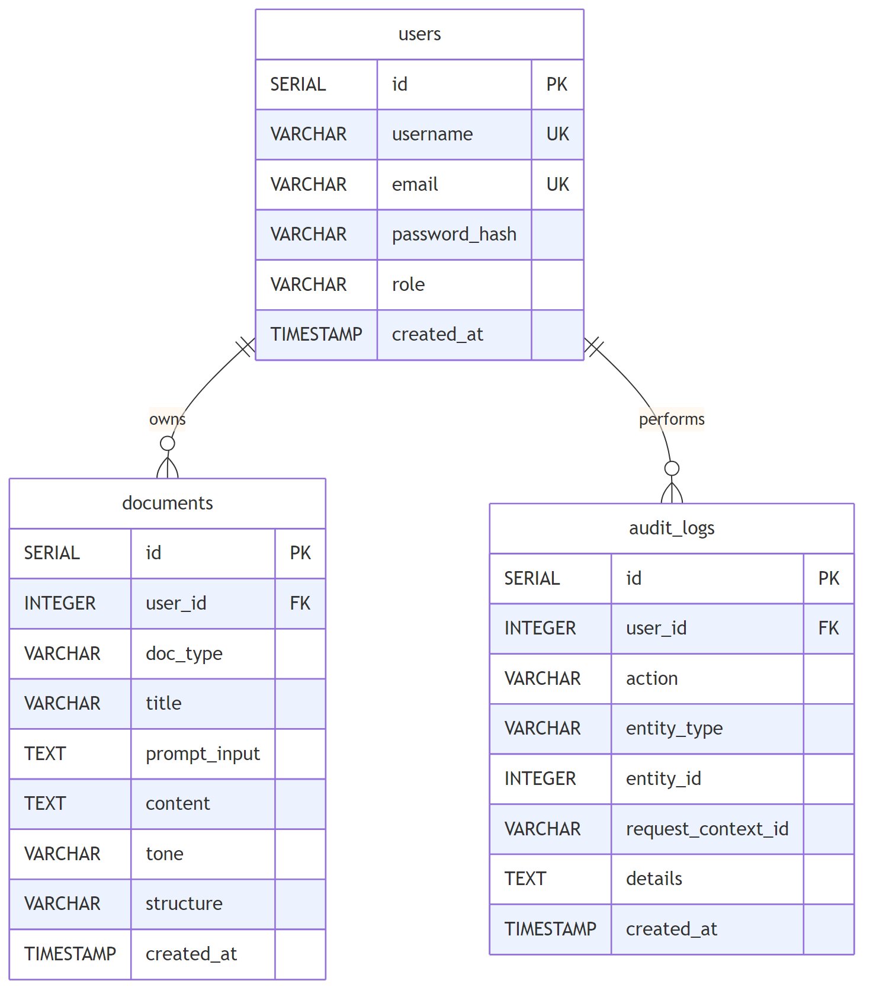

# **AI-Driven Email and Report Drafting System Using Generative Artificial Intelligence (Google Gemini)**

**Viswanatha Swamy P K**
Swamy’s Tech Skills Academy / Srivari Software Solutions

---

## **Abstract**

Professional communication through emails and reports is a repetitive and time-consuming activity in both corporate and academic environments. Maintaining consistency in tone, structure, and clarity often requires significant manual effort, particularly when working under time constraints. Recent advancements in Generative Artificial Intelligence (GenAI), especially Large Language Models (LLMs), have enabled automated generation of human-like text based on contextual instructions.

This project presents an **AI-Driven Email and Report Drafting System** that leverages **Google Gemini Large Language Models** to generate high-quality, context-aware professional content. The system is implemented using an **enterprise-grade N-Tier architecture** comprising a **React.js with TypeScript frontend**, a **Flask-based RESTful backend**, and a **PostgreSQL relational database**. Secure access is enforced using **JWT-based authentication** with **Role-Based Access Control (RBAC)** to distinguish between administrative and standard user privileges.

Instruction-based prompt engineering techniques are employed to control tone, structure, and output quality. All generated content is persisted for auditing and historical reference. The project demonstrates how Generative AI can be integrated into secure, scalable software systems while maintaining architectural rigor suitable for academic evaluation and real-world extensibility.

---

## **Keywords**

Generative Artificial Intelligence, Google Gemini, Prompt Engineering, JWT Authentication, N-Tier Architecture, Flask, React, PostgreSQL

---

## **1. Introduction**

Professional written communication plays a critical role in organizational workflows, including internal coordination, external correspondence, reporting, and documentation. Despite the availability of digital tools, drafting high-quality emails and reports remains a largely manual process that demands time, attention, and writing proficiency.

The emergence of Generative Artificial Intelligence (GenAI) and Large Language Models (LLMs) has introduced new possibilities for automating content creation. Models such as Google Gemini demonstrate strong capabilities in instruction-following, summarization, and structured content generation. However, many existing AI tools operate as standalone applications without proper authentication, data persistence, or enterprise architectural design.

This project aims to bridge that gap by integrating GenAI into a secure, enterprise-style web application. The focus is not only on content generation but also on architectural correctness, security, maintainability, and academic robustness.

---

## **2. Problem Statement**

Despite advances in digital communication tools, several challenges persist in professional content drafting:

1. **Time Consumption** – Manual drafting of emails and reports consumes valuable time that could be allocated to higher-value tasks.
2. **Consistency Challenges** – Maintaining a uniform tone and structure across documents is difficult, especially in fast-paced environments.
3. **Security Gaps** – Many AI-based tools lack proper authentication, authorization, and data persistence mechanisms.
4. **Architectural Limitations** – Small-scale AI tools often ignore enterprise design principles, limiting scalability and maintainability.
5. **Quality Variability** – Output quality depends heavily on individual writing skills and time availability.

This project addresses these challenges by providing a secure, scalable, and AI-powered drafting system built using enterprise architectural patterns.

---

## **3. Literature Review**

Recent research highlights the growing adoption of Large Language Models for automated text generation [6]. Studies on Generative AI demonstrate that instruction-based prompting significantly improves output relevance and structure [1]. Prompt engineering has emerged as a key discipline for controlling LLM behavior.

Security research emphasizes the importance of stateless authentication mechanisms such as JSON Web Tokens (JWT) for modern web applications [5]. JWT-based systems provide scalability and reduced server-side state management compared to traditional session-based authentication.

Enterprise architecture literature advocates N-Tier designs for separating concerns between presentation, application logic, and data storage layers. Such separation improves maintainability, testability, and system evolution.

Google Gemini represents a new generation of LLMs optimized for instruction-following and long-form content generation [1], making it suitable for professional communication use cases.

---

## **4. System Architecture**

The system follows a **four-layer N-Tier architecture**, ensuring clear separation of concerns and scalability.

### **4.1 Architecture Overview**

* **Presentation Layer**: React.js with TypeScript frontend
* **Application Layer**: Flask-based REST API
* **Data Layer**: PostgreSQL relational database
* **AI Service Layer**: Google Gemini API

### **4.2 High-Level Architecture**

**Figure 1** illustrates the high-level interaction between system components. User requests are routed through a secure REST API, processed by backend services, and delegated to the AI service for content generation.

> **Figure 1.** *High-level architecture of the GenAI Email and Report Drafting System, showing interaction between the presentation layer, application layer, AI service layer, and data layer.*

### **4.3 Detailed Architecture**

**Figure 2** presents a detailed view of internal services, including authentication, prompt engineering, document generation, and administrative APIs.

> **Figure 2.** *Detailed system architecture depicting frontend components, backend services, AI integration, and data persistence.*

---

## **5. Methodology and Implementation**

### **5.1 Frontend Implementation**

The frontend is implemented using React.js [3] with TypeScript to ensure type safety and modularity. Users interact with interfaces for login, email generation, report generation, document history, and administrative dashboards.

### **5.2 Backend Implementation**

The backend is implemented using Flask [2] and exposes RESTful APIs secured with JWT authentication. Business logic, authorization checks, and AI interactions are handled exclusively in the backend.

### **5.3 AI Integration and Prompt Engineering**

The AI service layer integrates Google Gemini using a dedicated service module. Instruction-based prompts define the role, task, tone, and output constraints. This approach ensures consistent and professional output.

### **5.4 Database Design**

PostgreSQL [4] is used to store user accounts, generated documents, and audit logs. The database schema comprises three main tables: **users** (authentication and role management), **documents** (generated content storage), and **audit_logs** (system activity tracking). Referential integrity is maintained using foreign keys, and timestamps are used for historical tracking.

**Figure 4** illustrates the complete Entity-Relationship Diagram (ERD) showing table structures, relationships, and key constraints.

> **Figure 4.** *Database Entity-Relationship Diagram depicting the schema structure with users, documents, and audit_logs tables along with their relationships and constraints.*

---

## **6. Authentication and Security**

The system employs **JWT-based stateless authentication**, ensuring scalability and secure API access. Passwords are stored using secure hashing mechanisms. Role-Based Access Control (RBAC) enforces permissions for **User** and **Admin** roles. The authentication and authorization workflow is illustrated in **Figure 3**.

Third-party identity providers such as Auth0 were intentionally excluded to reduce complexity and ensure reliability within an academic scope.

---

## **7. Testing and Validation**

A comprehensive testing strategy is adopted:

* Unit tests for backend services
* Integration tests for authentication and document generation
* Mocked AI API calls to avoid external dependencies
* CI pipelines for automated validation

Over 131 unit and integration tests validate core workflows and security-critical paths.

---

## **8. Results and Evaluation**

The system successfully generates professional emails and reports within seconds. Email generation averaged under 3 seconds per request under normal load, with report generation completing within 5 seconds. Evaluation metrics include content relevance, tone accuracy, time efficiency, and system reliability. Compared to manual drafting, the system significantly reduces effort while improving consistency.

---

## **9. Limitations**

* Output quality depends on clarity of user input
* No external fact verification is performed
* System availability depends on Gemini API uptime

---

## **10. Future Enhancements**

Future work includes:

* Integration with enterprise IAM solutions
* Analytics and reporting dashboards
* PDF and email export functionality
* Retrieval-Augmented Generation (RAG)
* Multilingual content generation

---

## **11. Conclusion**

This project demonstrates the successful integration of Generative Artificial Intelligence into a secure, enterprise-grade web application. By combining Google Gemini with N-Tier architecture, JWT authentication, and prompt engineering, the system provides a scalable and academically robust solution for automated professional content generation.

---

## **References**

1. Google Gemini API Documentation
2. Flask Web Framework Documentation
3. React.js Official Documentation
4. PostgreSQL Documentation
5. JSON Web Token (JWT) RFC 7519
6. Survey of Large Language Models for Text Generation

---

## **Figure 1 — High-Level System Architecture**

### **IEEE Caption (Figure 1)**

> **Figure 1.** High-level architecture of the GenAI Email and Report Drafting System illustrating interaction between the presentation layer, application layer, AI service layer, and data layer.

### **In-Text Reference (Figure 1)**

> *As shown in Fig. 1, the system follows an N-Tier architecture with a clear separation between frontend, backend, AI services, and persistent storage.*

---

## **Figure 2 — Detailed Component Architecture**

### **IEEE Caption (Figure 2)**

> **Figure 2.** Detailed system architecture showing frontend components, backend services, AI integration, and database interactions.

### **In-Text Reference (Figure 2)**

> *Fig. 2 illustrates the internal service decomposition of the system, including authentication, prompt engineering, document generation, and audit logging.*

---

## **Figure 3 — Authentication & Authorization Flow**

### **IEEE Caption (Figure 3)**

> **Figure 3.** JWT-based authentication and authorization workflow for secure access to system resources.

### **In-Text Reference (Figure 3)**

> *The authentication and authorization workflow implemented using JWT and RBAC is depicted in Fig. 3.*

---

## **Figure 4 — Database Entity-Relationship Diagram**

### **IEEE Caption (Figure 4)**

> **Figure 4.** Database Entity-Relationship Diagram showing the schema structure with users, documents, and audit_logs tables along with their relationships and constraints.

### **In-Text Reference (Figure 4)**

> *The database schema design with referential integrity constraints is shown in Fig. 4, demonstrating the relationships between users, documents, and audit logs.*

---

## **Figure Placement in IEEE Paper**

| Figure | Section                   | Placement  |
| ------ | ------------------------- | ---------- |
| Fig. 1 | System Architecture       | Section IV |
| Fig. 2 | System Architecture       | Section IV |
| Fig. 3 | Authentication & Security | Section VI |
| Fig. 4 | Database Design           | Section V  |

---

## ✅ IEEE COMPLIANCE CHECK

✔ Numbered figures
✔ “Fig.” usage in text
✔ Caption below figure
✔ Clear, grayscale-safe structure
✔ No decorative icons
✔ Academically defensible

---
